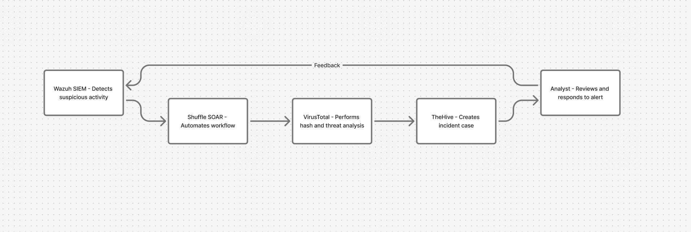

# SOC Automation Lab: Integrating Wazuh, TheHive, Shuffle, and VirusTotal

This project demonstrates how open-source tools can work together to automate threat detection, enrichment, and incident response in a Security Operations Center (SOC) environment.

## 🧩 Overview

The goal of this lab was to connect:
- **Wazuh (SIEM)** for log collection and detection  
- **Shuffle (SOAR)** for automation workflows  
- **VirusTotal** for threat intelligence enrichment  
- **TheHive** for case management and incident response  

Once Mimikatz runs on a monitored Windows 11 system, Wazuh detects it, triggers an automated workflow through Shuffle, checks the file hash on VirusTotal, and then automatically creates a case in TheHive — completing a full detection-to-response loop.

## 🏗️ Architecture Diagram

Below is a high-level flow of how these components interact:

## 📄 Documentation

You can explore the full setup documentation here:

- **[View Markdown Version](https://github.com/M-N-IQBAL/Cybersecurity-Projects/blob/main/SOC-Automation-Lab/SOC-Automation.md)**  
- **[Download PDF Version](https://github.com/M-N-IQBAL/Cybersecurity-Projects/blob/main/SOC-Automation-Lab/SOC-Automation.pdf)**

Both versions explain each step, from Wazuh setup to Mimikatz detection automation.

## ⚙️ Setup Summary

| Component | Purpose | Recommended Specs | Hostname |
|------------|----------|------------------|-----------|
| Wazuh | SIEM & log analysis | 8 GB RAM / 4 vCPUs | `wazuh` |
| TheHive | Incident response | 16 GB RAM / 4 vCPUs | `the-hive` |

### Key Steps
1. **Install and configure Wazuh** on your main VM.  
2. **Deploy TheHive**, ensuring Cassandra and Elasticsearch are properly linked.  
3. **Connect Shuffle** and **VirusTotal** through API integrations.  
4. **Add a Windows 11 agent** in Wazuh for event telemetry.  
5. **Detect Mimikatz activity** using a custom Sysmon-based rule.  
6. **Automate case creation and alerts** via Shuffle → VirusTotal → TheHive workflow.  

## 🧠 Learning Outcome
This lab helped understand how:
- SIEM and SOAR platforms complement each other.
- Threat intelligence APIs can enrich detection data.
- Incident response can be streamlined using automation.

This project was performed **strictly in a controlled lab environment** for educational purposes.  
Tools like *Mimikatz* were only used to simulate realistic detection scenarios.

### 🔗 Resources
- [Wazuh Documentation](https://documentation.wazuh.com/)
- [TheHive Project Docs](https://docs.strangebee.com/thehive/)
- [Shuffle SOAR](https://shuffler.io/)
- [VirusTotal API](https://developers.virustotal.com/reference)

I built this lab as part of my continuous learning journey in cybersecurity — exploring how detection and response can be automated with open-source tools.  
Feedback and suggestions for improvement are always welcome.

