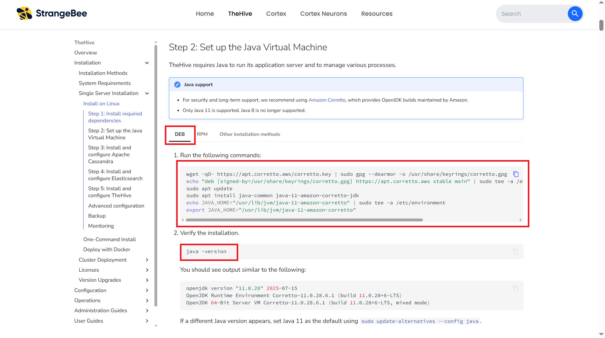
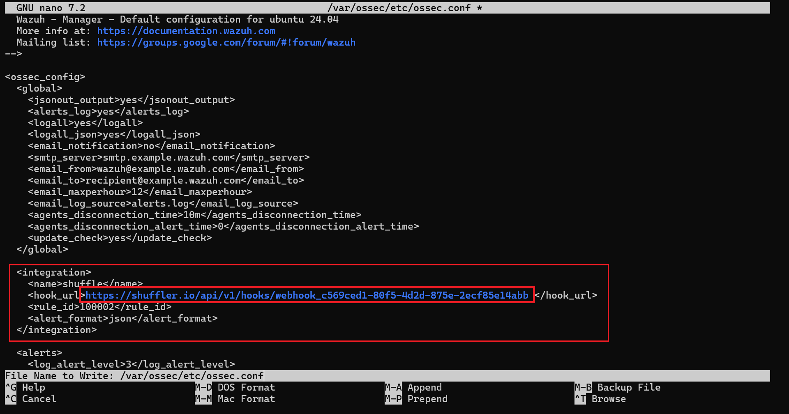
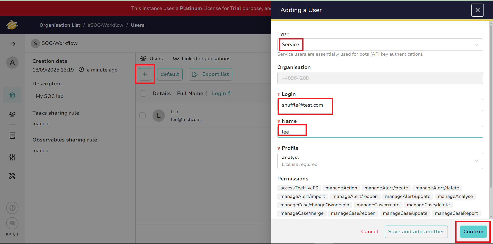

# 

# **SOC Automation Lab: Integrating Wazuh, TheHive, Shuffle, and VirusTotal**

## **Lab Overview**

This lab demonstrates how Security Operations Center (SOC) tasks can be automated by integrating multiple open-source tools. The goal is to reduce manual workload, improve detection and response speed, and provide security analysts with streamlined alerts.

## **Objectives**

By the end of this lab, a user will be able to:

* Monitor endpoints and servers using **Wazuh SIEM**

* Create and customize **rules and indexes** in Wazuh

* Add and manage **Wazuh agents** for log collection

* Detect suspicious activities (e.g., **Mimikatz usage**)

* Extract and analyze **file hashes (SHA-256)** from Wazuh logs

* Automatically submit hashes to **VirusTotal** for reputation checks

* Trigger automated workflows in **Shuffle** for alert enrichment

* Forward critical alerts to **TheHive** for case management

* Send **email notifications** to administrators when incidents are detected

## **Prerequisites**

Before you begin, ensure you have the following environment and tools ready:

### **Local Environment**

* **Host OS**: Windows 10/11

* **Virtualization**: VMware Workstation or VMware Player

* **Windows 11 VM**: Used as the endpoint machine (Sysmon \+ Wazuh agent installed)

### **Cloud Environment (DigitalOcean)**

* **Ubuntu VM \#1**: Wazuh SIEM Server

* **Ubuntu VM \#2**: TheHive (Incident Response Platform)

### **Tools & Services**

* **Sysmon** (installed on Windows 11 VM for detailed event logging)

* **Wazuh Agent** (installed on Windows 11 VM for log forwarding)

* **Shuffle** (cloud-hosted, used for automation workflows)

* **VirusTotal** (Free API key for hash reputation checks) 

* **Strangebee License** (Free Trial)

  * Registration on StrangeBee requires a valid **work** or **student** email address.

**Learning Outcomes**

During the development of this lab, I gained hands-on experience with:

* Deploying and configuring **Wazuh** for log analysis

* Creating custom **detection rules and indexes**

* Building **automation workflows** in Shuffle

* Ingesting alerts into **TheHive** for structured incident response

* Integrating third-party threat intelligence (**VirusTotal**) into the SOC pipeline

  Diagram 

## **Setting Up Windows 11 Virtual Machine**

In this section, you’ll set up a Windows 11 virtual machine, which will act as your monitored endpoint in the SOC Automation Lab.

### **1\. Download Windows 11 ISO**

1. Go to the official Microsoft download page: 👉 [Download Windows 11 Disk Image (ISO)](https://www.microsoft.com/en-us/software-download/windows11)

2. Under **“Download Windows 11 Disk Image (ISO) for x64 devices”**, select:

3. **Windows 11 (multi-edition ISO for x64 devices)** → click **Confirm**

4. Choose **Language** → *English (United States)* → click **Confirm**

5. Select **64-bit Download** → the ISO file download will begin.

### **2\. Create Windows 11 VM in VMware**

1. Open **VMware Workstation / Player**.

2. Click **Create a New Virtual Machine**.

3. Select **Typical (recommended)** → click **Next**.

4. Choose **Installer disc image file (ISO)** and browse to the Windows 11 ISO you downloaded → click **Next**.

5. Enter a username and password (make sure to remember it, you’ll need it later). → click **Next**.

6. Specify the **disk size** (use the recommended value) → click **Next**.

7. (Optional) Customize hardware settings (e.g., RAM, CPU, or network adapter). If unsure, the default configuration works fine.

8. Check **Power on this virtual machine after creation**.

9. Click **Finish**.

### **3\. Complete Windows 11 Installation**

1. The VM will start and boot from the ISO.

2. Follow the on-screen installation steps (language, edition, setup options).

3. Once installation is complete, log in with the password you created earlier.

Now you have a working **Windows 11 VM** inside VMware. This will be used later for deploying and testing SOC automation tools (Wazuh, TheHive, Shuffle).

## **Installing Sysmon on Windows 11 VM**

In this step, you’ll install Sysmon on your Windows 11 VM to generate rich security logs that Wazuh will later monitor and analyze.

### **Why Sysmon?**

Sysmon (System Monitor) is a Windows system service and device driver from the Sysinternals suite. It monitors and logs system activity, such as process creation, network connections, and file changes. In this project, you will use Sysmon to generate detailed security logs that can later be ingested by **Wazuh** for detection and automated response.

### **1\. Download Sysmon**

1. Inside your Windows 11 VM, open **Microsoft Edge**.  
2. Go to the official Sysmon download page: 👉 [Sysmon – Windows Sysinternals](https://learn.microsoft.com/en-us/sysinternals/downloads/sysmon)  
3. Click **Download Sysmon**.  
4. Once the download is complete, go to the download location.  
5. Right-click the Sysmon archive and select **Extract All** to unzip it.

### **2\. Download Sysmon Configuration**

1. Go to the olafhartong Sysmon Modular configuration on GitHub:[Sysmon Modular Configuration (olafhartong)](https://raw.githubusercontent.com/olafhartong/sysmon-modular/refs/heads/master/sysmonconfig.xml)  
2. Right-click on the page → **Save As**.  
3. Name the file **`sysmonconfig.xml`**  
4. Save it in the same Sysmon folder you extracted earlier.

### **3\. Install Sysmon with Configuration**

1. Open **PowerShell as Administrator**.  
2. Navigate to the Sysmon directory:  `cd "C:\path\to\Sysmon"`
3. Run the installation command:   `.\Sysmon64.exe -i sysmonconfig.xml` 
4. Accept the license agreement.  
5. After installation, you should see the message:   **`Sysmon64 started.`**  
6. Run the following command to confirm Sysmon is running:	Get-Service -Name sysmon64  
7. If the **Status** shows **`Running`**, Sysmon has been successfully installed.   
8. To verify logs are being generated, open Event Viewer → **Applications and Services Logs → Microsoft → Windows → Sysmon → Operational.**

**4\. Create a VMware Snapshot**

It’s a good practice to save your VM state after installing Sysmon.

1. In VMware, go to the top menu → **VM** → **Snapshot** → **Take Snapshot**.  
2. Give your snapshot a descriptive name (e.g., *After Sysmon Installation*).  
3. Click **OK**.

✅ You now have **Sysmon installed and running** with a modular configuration, and a **VM snapshot** saved for rollback if needed.

## **Setting Up Wazuh and TheHive on DigitalOcean**

In this step, you’ll deploy cloud-based Ubuntu servers for Wazuh and TheHive using DigitalOcean. These will act as your SOC’s backend systems.

### **1\. Sign Up for DigitalOcean**

1. You can sign up here on DigitalOcean: [https://m.do.co/c/28868f21cdd3](https://m.do.co/c/28868f21cdd3)   
2. You can also use Vultr as an alternative: [https://www.vultr.com/register/](https://www.vultr.com/register/)  
3. Create an account using a **valid credit/debit card**.  
   * DigitalOcean will temporarily charge **$1 for verification**, which is refunded after setup.  
4. After logging in, go to **Projects** → click **New Project**.  
5. Give your project a **name** (e.g., `SOC-Automation`) and select its **purpose**.  
6. Click **Create Project**.

### **2\. Create Wazuh Droplet**

1. Inside your project, click **Create** → select **Droplets**.  
2. Configure your Droplet as follows:  
   1. **Image**: Ubuntu 24.04 (LTS) x64  
   2. **CPU Options**: Regular  
   3. **Size**: 8 GB RAM / 4 vCPUs / 160 GB SSD Disk / 5 TB Transfer  
   4. **Authentication**: Password (create a strong password and note it down)  
        
   5. **Hostname**: **`Wazuh`** (you can choose any name, but functional names keep things organized)  
   6. Select the project you created earlier.  
   7. Click **Create Droplet**.  
   8. To connect to your Droplet later, use: `ssh root@<droplet-ip>`

### **3\. Create TheHive Droplet**

Repeat the same steps as above, but this time:

* **Hostname**: **`TheHive`**

* **Recommended Size**: Ideally 16 GB RAM (TheHive is more resource-intensive than Wazuh).

  * If 16 GB isn’t available in your plan, use the same specs as the Wazuh Droplet (8 GB RAM / 4 vCPUs).

### **4\. Verify Droplets**

1. After creation, you will see both VMs listed under your project.  
2. Note down the **public IP addresses** for **`Wazuh`** and **`TheHive`**.  
3. You will use these IPs later to connect via SSH and install the respective tools.

✅ At this point, you have two Ubuntu VMs running on DigitalOcean:

* **`Wazuh` →** for SIEM setup  
* **`TheHive`** → for incident response and case management

  Droplet   Purpose   Recommended Specs   Hostname  
  :---:   :---:   :---:   :---:  
  Wazuh   SIEM & log analysis   8 GB RAM / 4 vCPUs   Wazuh  
  The-Hive   Incident response   16 GB RAM / 4 vCPUs   The-Hive  

## **Connect to the Wazuh VM**

1. Open **PowerShell** on your local machine.  
2. Run the following command (replace with your Wazuh VM IP): `ssh root@{your-wazuh-vm-ip}`  
3. Type **`yes`** and press **Enter**.  
4. Enter the VM password you created during set

You are now inside your Wazuh VM.

Run the following to update your packages: 

` apt-get update && apt-get upgrade -y `


## **Install Wazuh**

1. Go to the official Wazuh installation guide: [Wazuh Quickstart](https://documentation.wazuh.com/current/quickstart.html)  
2. Copy the **latest installation command** shown there.  
3. Paste it into your Wazuh VM and press **Enter**.


If everything is successful, you will see:

* A generated **user and password** → Write these down\! You will need them for the Wazuh web dashboard.  
* **Installation finished message**

### **Verify Wazuh Service**

Check the status of the Wazuh manager service: systemctl status wazuh-manager.service

* If it’s **running** → you’re good to go.  
* If not, restart the service and check again:

`systemctl restart wazuh-manager.service
systemctl status wazuh-manager.service `


### **Access the Wazuh Web Interface**

1. Open your browser and go to: **https://{your-wazuh-vm-ip}**  
2. If you cannot access it, allow HTTPS traffic (port 443): `sudo ufw allow 443  `
3. Try again — you should now see the Wazuh dashboard.  
4. Log in using the **username and password** you saved earlier.

Once logged in, you should see the Wazuh Dashboard Overview showing system status, agent summary, and alert statistics. This confirms that your Wazuh installation is active and operational.✅

👉 If it still doesn’t work, check your **cloud provider firewall settings** (DigitalOcean, AWS, Azure, Vultr, etc.) and allow port **443**.

## **Installing TheHive**

### **Register for TheHive**

Go to the official StrangeBee portal and register for an account: 👉 [Register here](https://portal.apps.strangebee.com/account/register)

📌 **Note:** TheHive requires a work or student email. They also provide a free trial.

### **Connect to TheHive VM**

* Open PowerShell on your local machine and connect via SSH (replace with your TheHive VM IP): ssh root@{your-thehive-vm-ip}  
* Type **`yes`** when prompted, then enter your VM password.  
* Update your system packages: `sudo apt update && apt upgrade -y`

## **Install Dependencies**

Follow the official StrangeBee installation guide:  
 👉 [TheHive Installation Guide (Linux Standalone Server)](https://docs.strangebee.com/thehive/installation/installation-guide-linux-standalone-server/#step-1-install-required-dependencies)

Copy and run the commands exactly as shown in the documentation.





After installing Java, verify the version:  `java -version`

If no version is displayed, rerun the Java installation command (the one starting with **`wget ...`**),

then confirm installation again with:  `java -version`

## **Install Cassandra**

Follow the official Apache Cassandra installation guide

  
 Once installed, configure it properly before starting TheHive.

## **Install Elasticsearch**

Next, install Elasticsearch.


## **Install TheHive**

Use **`wget`** (recommended) to download and install TheHive.

👉 If you prefer **`curl`** or another method, scroll down in the StrangeBee docs and copy the relevant command:

## **Configure Cassandra**

Open the Cassandra configuration file:  `nano /etc/cassandra/cassandra.yaml`

If cassandra.yaml is missing, Cassandra likely didn’t install correctly. Reinstall it before proceeding.

**Edit the following keys** (use **`CTRL+W`** in nano to search each key):

``` 
cluster_name: 'soc-workflow' 
listen_address: {thehive-vm-ip}
rpc_address: {thehive-vm-ip}
   - seeds: "{thehive-vm-ip}:7000" 
```
Save and exit: **CTRL+X → Y → Enter**

**Restart Cassandra cleanly:**

`sudo systemctl stop cassandra.service`

`sudo rm -rf /var/lib/cassandra/*`

`sudo systemctl start cassandra.service`

`sudo systemctl status cassandra.service`


✅ If the status shows **active (running)**, Cassandra is ready.

## **Configure Elasticsearch**

Open the configuration file: `nano /etc/elasticsearch/elasticsearch.yml`

⚠️If elasticsearch.yml is missing, Elasticsearch likely didn’t install correctly. Reinstall it using the previous steps.

Then open the configuration file again: `nano /etc/elasticsearch/elasticsearch.yml`

**Update the following keys** (use **`CTRL+W`** in nano to search each key): 

```
 cluster.name: soc-workflow
 
node.name: node-1
network.host: {hive-vm-ip}
 http.port: 9200 
 cluster.initial_master_nodes: ["node-1"] 
```


Save and exit: **CTRL+X → Y → Enter**

**Restart and enable Elasticsearch:**

`sudo systemctl start elasticsearch.service`

`sudo systemctl enable elasticsearch.service`

`sudo systemctl status elasticsearch.service `

✅ If the status shows **active (running)**, Elasticsearch is ready.

## **Configure TheHive**

Before configuring TheHive, update file permissions for its directory:

```cd /opt/thp
ls -l
sudo chown -R thehive:thehive /opt/thp
ls -l 
```
✅ This ensures TheHive has proper access to its files.  
  
**Open the configuration file:**   `sudo nano /etc/thehive/application.conf ` 

⚠️ If application.conf is missing, TheHive likely didn’t install correctly. Reinstall it before proceeding.

**Edit the following keys** (use **`CTRL+W`** in nano to search each one):

``` 
 hostname = ["{thehive-vm-ip}]"

cluster-name = soc-workflow

backend = elasticsearch
    hostname = ["{thehive-vm-ip}"]

application.baseUrl = "http://{thehive-vm-ip}:9000" 
```


Save and exit: **CTRL+X → Y → Enter**

**Restart and enable TheHive**

``` 
sudo systemctl start thehive.service
sudo systemctl enable thehive.service
sudo systemctl status thehive.service  
 ```

✅ If the status shows **active (running)**, TheHive is ready.

Verify all required services are running

``` 
sudo systemctl status cassandra.service
sudo systemctl status elasticsearch.service
sudo systemctl status thehive.service  
 ``` 

All three must show **active (running)** before you proceed.  


Once all services are running, open your browser and go to:  
**http://{your-hive-vm-ip}:9000**  
You should now see **TheHive login page** 🎉  
  
If the page doesn’t load, your firewall might be blocking port 9000\.  
Allow it using: ` sudo ufw allow 9000 `

To find the **latest default credentials** or learn how to perform the initial admin setup, refer to the official StrangeBee documentation:  
👉 [Perform Initial Setup as Admin — TheHive Docs](https://docs.strangebee.com/thehive/administration/perform-initial-setup-as-admin/)  
This ensures you always use the **most up-to-date credentials and security setup** recommended by TheHive team.

## **Integrate Windows 11 VM with Wazuh**

Now that both **Wazuh** and **TheHive** servers are running on your DigitalOcean VMs, you can connect your **Windows 11 VM (in VMware)** as a Wazuh agent.

### **Access the Wazuh Dashboard**

Inside your Windows 11 VM:

1. Open your browser and go to **https://{your-wazuh-vm-ip}**  
2. Log in using your Wazuh dashboard credentials.

**Add a New Agent**

1. In the Wazuh dashboard, click **“Deploy new agent.”**  
   ****  
2. Select **Windows** as the agent type.  
3. In **Server address**, enter your Wazuh server IP.  
4. Assign a friendly **Agent name** such as **`Windows-11`.**  
     
5. Copy the **PowerShell commands** shown on the screen.

### **Install the Agent on Windows**

1. Open **PowerShell as Administrator** in your Windows VM.  
2. Paste and run the copied commands.  
3. Return to the Wazuh dashboard and refresh the **Agents Summary** page.  
   

 You should now see **`Active (1)`** under agents.

If the agent does not appear active:

**On your Wazuh VM**, allow the following ports:

```
sudo ufw allow 1514
sudo ufw allow 1515  
```
 

**On your Windows VM**, restart the Wazuh service:  `Restart-Service -Name "wazuh"   `
Refresh the dashboard again. The agent should now appear as active.

### **Configure Sysmon Telemetry in Wazuh**

To enhance visibility, integrate **Sysmon** logs with your Windows Wazuh agent.

**Backup Configuration**

Make a backup of your current Wazuh agent config file: **C:\Program Files (x86)\ossec-agent\ossec.conf**

Copy it to another location (for example, your Desktop).

#### **Edit Configuration**

1. Open **Notepad as Administrator**.  
2. Press **`Ctrl + O`** and navigate to: **C:\Program Files (x86)\ossec-agent**  
3. Open **`ossec.conf`**.  
4. Locate and remove the highlighted default log entries.

#### **Add Sysmon Logs**

1. Open **Event Viewer** → **`Applications and Services Logs` → `Microsoft` → `Windows` → `Sysmon` → `Operational`**.  
2. Right-click **`Operational`** → **`Properties`** → copy the **`Full Name`**.  
3. Paste this log path inside your **`ossec.conf`** file under the **`<localfile>`** section.  
4. Save the file and restart the Wazuh service

**Disable Windows Defender (for Lab Purposes Only)**

1. Open **`Windows Security`** → **`Virus & threat protection`**.  
2. Scroll down to **`Exclusions`** → **`Add or remove exclusions`**.  
3. Click **`Add an exclusion` → `Folder`** → select **C:\\**

  
  
You have now successfully connected your **Windows 11 VM** to **Wazuh** and enabled **Sysmon telemetry**.

## **Install Mimikatz** 

1. Visit the official Mimikatz GitHub:  
   1. 👉 [https://github.com/gentilkiwi/mimikatz/releases](https://github.com/gentilkiwi/mimikatz/releases)  
2. Download and extract the latest release.  
3. Open **Command Prompt or PowerShell** inside the **`x64`** folder.


Now Mimikatz is ready for use in your test environment.

## **Configure Wazuh to Detect Mimikatz Activity**

In your **Wazuh VM**, open and verify the logging configuration:  `nano /var/ossec/etc/ossec.conf `

Ensure these lines are set to:

```
  <logall>yes</logall>
  <logall_json>yes</logall_json>  
```


Save the file and restart Wazuh:   `systemctl restart wazuh-manager.service` 

Check **`/var/ossec/logs/archives/`**  logs should now be generated there.  


Adjust Filebeat Configuration:   `nano /etc/filebeat/filebeat.yml `

  
save (**`Ctrl + X → Y → Enter`**), and restart:  systemctl restart filebeat.service 

Now return to your **Wazuh dashboard** and create a **new index**.  
  
  
  
  


### **Create a Detection Rule for Mimikatz**

  


Add the following custom rule to your ruleset:

  <group name="local,syslog,sshd,">
  <rule id="100001" level="5">
    <if_sid>5716</if_sid>
    <srcip>1.1.1.1</srcip>
    <description>sshd: authentication failed from IP 1.1.1.1.</description>
    <group>authentication_failed, pci_dss_10.2.4, pci_dss_10.2.5</group>
  </rule>

  <rule id="100002" level="15">
    <if_group>sysmon_event1</if_group>
    <field name="win.eventdata.originalFileName" type="pcre2">(?i)mimikatz\.exe</field>
    <description>Suspicious Mimikatz activity detected on system</description>
    <mitre>
      <id>T1003</id>
    </mitre>
  </rule>

</group>  
 

  


#### **Rule Explanation (In Simple Terms)**

* **Rule 1:** Detects repeated SSH authentication failures from IP **`1.1.1.1`**.

* **Rule 2:** Detects Sysmon Event ID 1 (process creation) if the executable name is **`mimikatz.exe`**.  
   → This triggers a **level 15 alert** with MITRE technique **T1003 (Credential Dumping)**.

### **Validate the Rule**

1. Run **Mimikatz** again in your Windows VM.

2. Go to your **Explore** → **Discover** → select **wazuh-alerts** → search **mimikatz**.You should see an alert labeled **“**Suspicious Mimikatz activity detected on system**”**

## **Automating SOC Alerts with Shuffle**

Now that detection is working, let’s automate the response workflow using **Shuffle**.

#### **Create a Shuffle Account**

Go to [https://shuffler.io](https://shuffler.io) → **Sign up / Log in** → In the sidebar, click **Workflows** → **\+ Create Workflow** → name it **`soc-workflow`**.

#### **Add Webhook Integration**

* From the **left panel**, drag **Webhook** onto the canvas.

* Copy its **Webhook URI**.

Now, go back to your **Wazuh VM** and open the config file:  `sudo nano /var/ossec/etc/ossec.conf `

Add this under the **`</global>`** tag:

```
  <integration>
  <name>shuffle</name>
  <hook_url>{your-webhook-URI}</hook_url>
  <rule_id>100002</rule_id>
  <alert_format>json</alert_format>
</integration>  
``` 

  
Save and restart the service:  ` sudo systemctl restart wazuh-manager.service `

In Shuffle, click **Start Webhook** to begin listening.  


#### **Test the Webhook**

Run **Mimikatz** again in your Windows VM.  
Then go to **Explore Runs** in Shuffle → you should see data received successfully.


#### **Add SHA256 Extraction**

* Delete the “Change Me” icon.  
    
* Drag **Shuffle Tools** → rename it → under **Find Actions**, choose **`Regex Capture Group`**.

* Use this Regex:  
 **`SHA256=([0-9A-Fa-f[{64})`**  
* For **Input data**, click the ⨁ icon → select **Runtime Argument → hashes**.

#### **Add VirusTotal Integration**

* Go to [https://www.virustotal.com](https://www.virustotal.com)→ Sign in → click your profile → **API Key** → copy it.  
    
* In Shuffle, drag the **VirusTotal** app → click **Authenticate** → paste your API key.  
  

  


* Connect it with the SHA256 output.

Save your workflow and refresh the page.

Test again by running Mimikatz in your Windows VM → you should see **`"success": true`** and **`"status": 200`** in Shuffle.


#### **Add TheHive Integration**

Go to your TheHive dashboard: [http://{your-thehive-vm-ip}:9000](http://{your-thehive-vm-ip}:9000)

1. Create a new **Organization** → click **\+**.  
     
2. Inside it, create a **User Account** → click **\+** → fill in details → set password → Confirm.  
     
3. Inside it, also create a **Service Account** → click **\+** → fill in details → set password → Confirm.  
     
4. Go to **Service Accounts** → create → copy its **API key**

Now in Shuffle:

* Drag **TheHive** app → click **Authenticate** → use the service account API key.  
    
* Connect it after VirusTotal.

Paste this body:

```
{
  "description": "$exec.title",
  "externallink": "${externallink}",
  "flag": false,
  "pap": 2,
  "severity": "3",
  "source": "$exec.pretext",
  "sourceRef": "$exec.rule_id",
  "status": "New",
  "summary": "Mimikatz usage detected on host: $exec.text.win.system.computer",
  "tags": ["T1003"],
  "title": "$exec.title",
  "tlp": "2",
  "type": "Internal"
}  
```


Save and run the workflow → verify on TheHive that a **new alert** appears.


#### **Add Email Notification**

* Drag the **Email** app onto the board.  
* Connect it after VirusTotal or TheHive.  
* Configure the recipient email address.  
* Paste this into the Body field:

```
Mimikatz execution identified  
Time: $exec.all_fields.full_log.win.eventdata.utcTime  
Title: $exec.title  
Host: $exec.text.win.system.computer    
```

You can also include other dynamic elements by clicking the `⨁` icon → **Runtime Argument** → and selecting the desired field (for example, *rule_id*, *hashes*, or *description*).  


Save and run the workflow again  you should now receive an email alert.


You’ve successfully built and automated an end-to-end SOC response pipeline.  
 Here’s what happens when **Mimikatz** is executed on your Windows VM:

1. **Wazuh** detects the activity using custom rule **`100002`**.

2. **Shuffle** receives the alert through the Wazuh webhook.

3. The workflow automatically **extracts the SHA256 hash** of the detected file.

4. **VirusTotal** is queried to check the file’s reputation.

5. If confirmed suspicious, a **case is created in TheHive** for investigation.

6. **Email notifications** are sent to inform the analyst of the incident.

## **Conclusion**

By completing this lab, you have successfully built a functional SOC automation pipeline that integrates Wazuh, TheHive, Shuffle, and VirusTotal.  
 You now understand how alerts can be automatically detected, analyzed, enriched, and escalated without manual effort.

You can extend this lab by:

* Adding more detection rules, such as PowerShell abuse or persistence techniques

* Integrating additional threat intelligence sources like AbuseIPDB or AlienVault OTX

* Creating advanced workflows in Shuffle to automate alert enrichment and case prioritization

This lab serves as a foundation for building enterprise-grade SOC automation using open-source tools. Continue exploring, testing, and improving to enhance your incident response capabilities.

